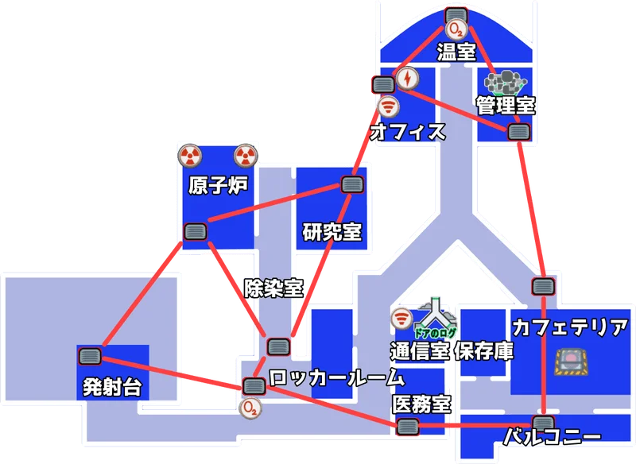

# Amoung Us

## アジェンダ

- [入門者](#入門者)
- [初心者](#初心者)
- [中級者](#中級者)
- [上級者](#上級者)
- [知識編](#知識編)
- [テクニック編](#テクニック編)

## 入門者

基本的な操作（移動やキル、タスク処理）などを覚えること  
数回遊ぶことで基本的なことは身に付く

## 初心者

基本操作以外で最も大切なことを覚えること

### インポスター

会議時間を無駄に消費させること、疑いを他に向けることが大切になる  

- 会議以外編
  - サボタージュを使うこと※1
  - [死体発見が難しい場所（工事中）](#死体発見が難しい場所)でキルすること
  - 会った人を覚えること※2
- 会議編
  - 容疑者を増やす
  - インポスター特定ができる話から遠ざける※3

※1：サボタージュのメリットとしては、キルクールタイム稼ぎ、タスク妨害、死体発見までの時間稼ぎ、ストレスを与える  
※2：インポスターだと疑われないために必要（忘れたフリをするのは自由）  
※3：例としては、二人がキルされた場合、死体発見されていない方の話に逸らすなど

### クルー

正確な情報を伝えること、不要に会議時間を消費させないことが大切になる 

- 会議以外編
  - 発見しやすい場所※1でキルされること
  - 会った人物は覚えること（時系列も気にする）
- 会議編
  - 正確な情報を伝えること
  - 不要な情報で会議時間を消費しないこと
    - 最終位置を聞いているのに、最初から全て伝えるなど
  - 間違いを正す
    - インポスターやクルーが間違ったことを言った場合は正す

※1：[発見が難しい場所](#死体発見が難しい場所)でのキルを避けること

## 中級者

Amoung Usで勝つため、楽しむためのリスクの低い事項を学ぶ

### インポスター

死体発見を遅らせること、アリバイを作ることが大切になる

- 会議以外編
  - サボタージュの時間を意識
  - サボタージュで死体からクルーを遠ざけること
  - キル対象を選ぶこと※1
  - 相方が近くにいる際はキルしないこと
  - アリバイを作ること※2
  - キルテクニックを学ぶこと
    - 停電中にキル
    - ドサキル※3
    - キル直後に緊急会議
    - アドミン情報でキル対象を決定
- 会議編
  - 会議終了直前にクルーへ投票
  - 緊急会議を無駄に使わせる
  - 自分を必死に擁護しすぎない

※1：考察力の高いクルー、白いクルーなどを優先してキルする  
※2：クルーに見られること  
※3：たくさんの人でごちゃごちゃしているところでキルすること

### クルー

インポスターの嘘情報を見破ること、キルされないこと、会議内容を頭の中でまとめることが大切になる  

- 会議以外編
  - 怪しい人物には近寄らない
  - 危険なタスクを安全に行う
  - 緊急会議の間を開けすぎない
  - アドミン、セキュリティカメラを利用する
- 会議編
  - **会議の進め方**
    1. **死体の場所とキルタイミングの範囲を特定する**
    2. 白とグレーを切り分ける
    3. グレーの詳細を聞くことに時間を割く
    ※後半はタスク進捗度も気にする
  - 騙されないこと
    - 時間をぼかされないように注意※1
    - 死体位置、アドミン情報、カメラ情報、すれ違った人など
  - キルクールタイムを意識する

※1：例として、電気室で通報がされた場合、インポスターが管理室からカフェテリア移動で最終位置と宣言する。管理室から出るところを他のクルーが見ていても時系列次第では医務室ベントもあることに注意。

## 上級者

Amoung Usで勝つため、楽しむために
　・インポスターは、ハイリスク・ハイリターンを学ぶ
　・クルーは、詰め方を学ぶ

### インポスター

ハイリスク・ハイリターンな嘘をつく行為、ハイリスクなキルを取り入れていく（筆者はできてないです）

- 会議以外編
  - ベントを利用してキル後に遠くへ移動する
    - 【リスク】アドミン情報でベント移動がバレることがある
    - 【リスク】ベント移動を見られることがある
  - 怪しい行動をしない※1
  - キルテクニック
    - クルーに付いていって、一瞬離れて他のクルーをキルする※4
    - クルー2、インポスター2で行動する際に、2キルを狙う
    - 死体位置で待ち伏せしてキル
    - サボタージュ位置でキル
- 会議編
  - 騙す
    - 曖昧なことを言う※2
    - 会議情報から、他の人がいない場所に居たことにする※3
    - 不利な情報をスキップする※4
  - 悪印象をインポスター疑惑に変える※5
  - アドミン情報で人がいないところを見ておくと嘘をつきやすい
  - 不利な情報を出されないように自分の行動を勢いで話す

※1：ロングタスク以外に長時間いる、何もないとこに止まっているなど  
※2：例としては、「アドミン情報を伝えるけど、確か、セキュリティに一人...二人だっけ？そのくらい居たかな？」と言う。これは一人でも二人でも正確な情報を言っていると勘違いさせられる。クルーであるという信頼を得られる（三人だったら、誰かが出た時だったかもとか言っておく）  
※3：例としては、「管理室にカフェテリアに移動して通報が入った」と言うと電気室などのキルはできないと思われる。本当は医務室に行っている可能性もある。（TheSkeld想定）  
※4：例として、クルーに付いていって、一瞬離れて他のクルーをキルしたとする。この場合、「ずっと一緒にいたので無理」と言うと白判定を貰える。一瞬離れたことは伝えない。  
※5：時系列が整理できていない場合に、嘘ついているという悪い印象を「怪しいな〜とか、〇〇がインポスターじゃね？」とインポスター疑惑をさらっと刷り込む。

### クルー

キルされないこと、相手の嘘を見破ること

- 会議以外編
  - 他の人と常に一緒に行動する
  - ごちゃごちゃしたところに入らない
  - 生存テクニック
    - 危険な場所のタスクは適度に人数がいる時に行う
    - 緊急会議でキルクールタイムを超えないようにする
- 会議編
  - 嘘を見抜く
    - <インポスター数> + 1の証言がない場合は嘘の可能性がある
  - インポスター上級編の騙すテクニックに注意すること
  - アドミン情報、ドアのログ、死体位置、バイタル、なんでも嘘の可能性があることに注意※1

※1：明らかに間違っている場合は、指摘することが大切（全員の共通認識で怪しい人を作り出す）

## 知識編

### 各マップ情報

[こちら](https://gamerch.com/amongus/entry/224819)より引用

#### THE SKELD

#### MIRA HQ

#### POLUS

#### THE AIRSHIP

### 死体発見が難しい場所

タスクが少なく、通行時に見えない場所となる

- The Skeld
  - カフェテリア上部
  - ウェポンルームの上部
  - ナビゲーションのベント部分
  - シールドルーム下部
  - 通信室奥
  - 保管庫下
  - 下部エンジン左下
  - 原子炉下部
  - 上部エンジン左上
- Mira HQ
- Polus※1
  - 管理室左下
  - 管理室左下外
  - セキュリティルーム
  - 原子炉の場所
  - 研究室右のスキャン
  - 酸素ルームの左下の部屋
  - ウェポンルーム
- The Airship

※1：筆者は、このステージやったことないです

## テクニック編

- 誰かにピッタリ付いていくと心が白くになれる
